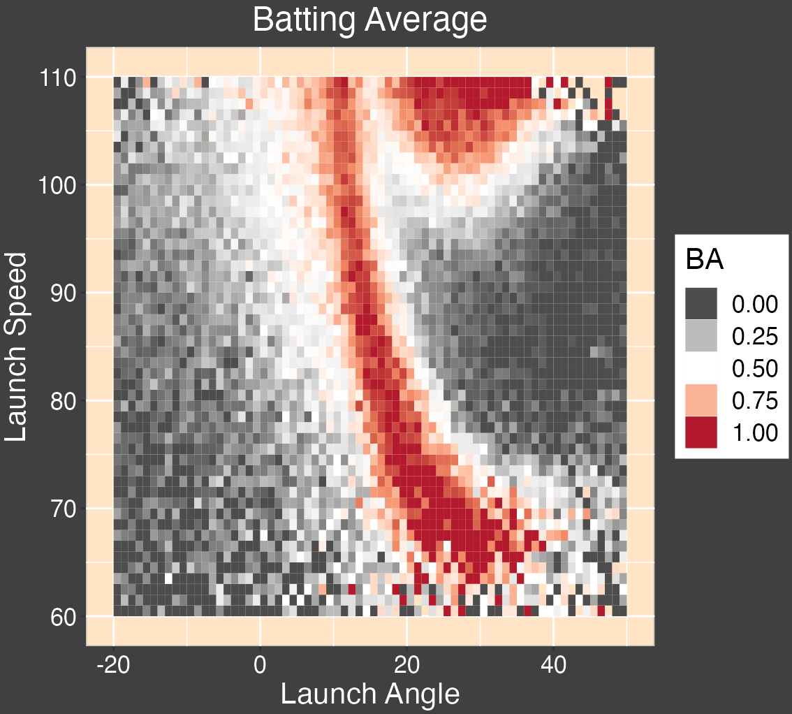

```{r setup, include=FALSE}
knitr::opts_chunk$set(echo = TRUE)
```

### January 26 meeting

The goal here is to explore the idea of expected hits and expected batting average.

Here's a blog post on the topic that you can read:

https://bayesball.github.io/BLOG/BAVG.html#expected-batting-average-and-hits-added

### Data

Statcast measures launch angle (degrees) and exit velocity (mph) of each ball put into play.

Statcast also measures the location of the batted ball on the field from which you can compute a spray angle.

We read in Statcast in-play data from the 2022 season.

```{r}
library(readr)
scip <- read_csv("https://raw.githubusercontent.com/bayesball/HUGO/main/January%2026/sc2022_ip.csv")
```

This dataset has seven variables:

```{r}
spec(scip)
```

### Explore launch angles and exit velocities

### Launch variables and hits

Balls hit with suitable values of LA and EV tend
to be hits.



Relate to the type of batted ball (ground ball,
line drive, fly ball, pop up).

### Expected Batting Average

Statcast data has a variable `estimated_ba_using_speedangle` which estimates the probability of a hit for a batted ball given the LA and LS measurements.

Define

- xH = expected hits
- xBA = expected batting average
- HA = hits added = H - xH

Compute for each hitter in the 2022 season
H, xH, BA, xBA, HA.


